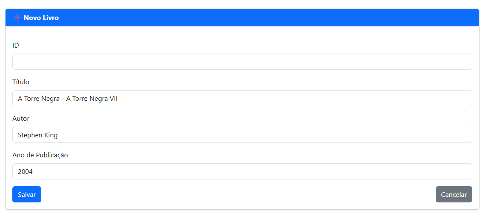

 # Projeto CRUD: Gestão de Livros com Spring Boot e Thymeleaf

## Objetivo

Desenvolvimento de uma aplicação web completa para gerenciamento de livros, aplicando o padrão MVC (Model-View-Controller) de forma correta e utilizando tecnologias modernas da stack Spring.

O sistema implementa o CRUD (Create, Read, Update, Delete) para a entidade Livro.

⚙️ Tecnologias Utilizadas

- Backend: Spring Boot 3+ (Java)

- Framework Web: Spring Web

- Persistência: Spring Data JPA

- Banco de Dados: H2 (Em memória, para facilitar a execução local)

- Template Engine: Thymeleaf

- Frontend: HTML5 + Bootstrap 5 (Layout responsivo e organizado)

## Passos para Executar a Aplicação Localmente *

Para rodar este projeto em sua máquina, siga os passos abaixo:

### 1. Pré-requisitos
   Certifique-se de ter instalado:

Java Development Kit (JDK) 17 ou superior

Maven ou Gradle

Uma IDE de sua preferência (IntelliJ IDEA, VS Code ou Eclipse)

### 2. Clonar o Repositório
   Abra o terminal e clone o projeto do GitHub:
   
    git clone [URL_DO_SEU_REPOSITORIO]
    cd nome-do-seu-projeto

### 4. Acessar a Aplicação
A aplicação será iniciada na porta padrão do Spring Boot (8081) ou na porta configurada no application.properties

    http://localhost:8081/livros

## Prints das Telas Principais

### 1. Tela de Listagem (Home)

### 2. Tela de Cadastro/Edição

